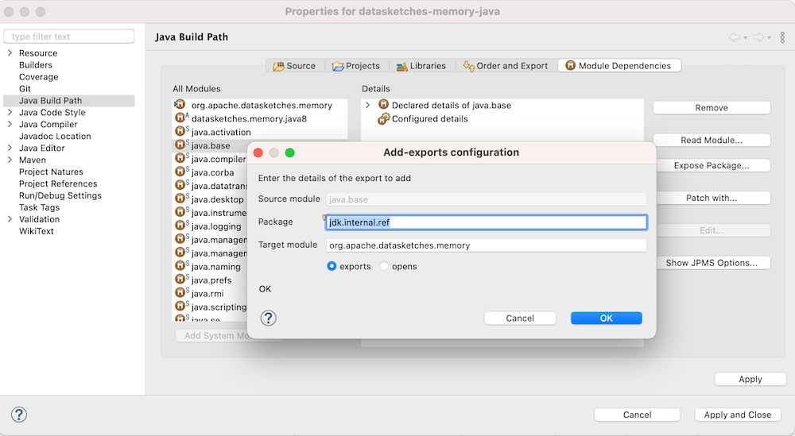
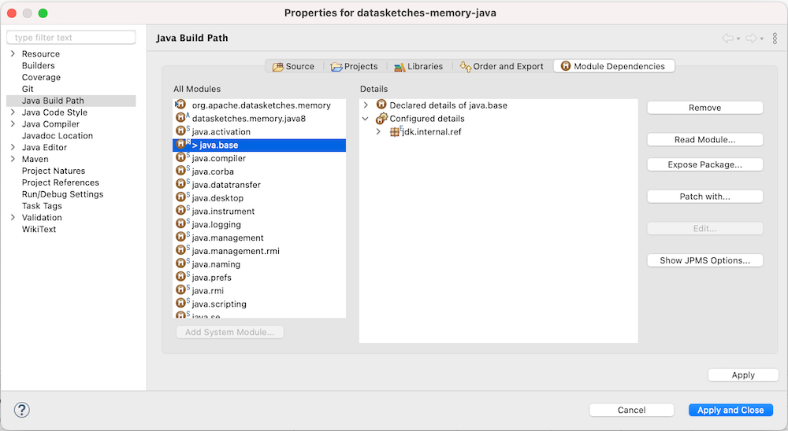
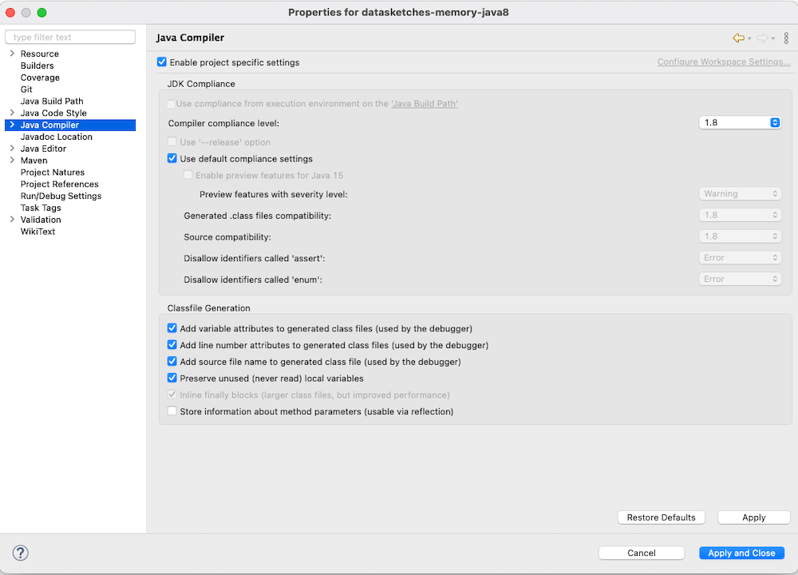
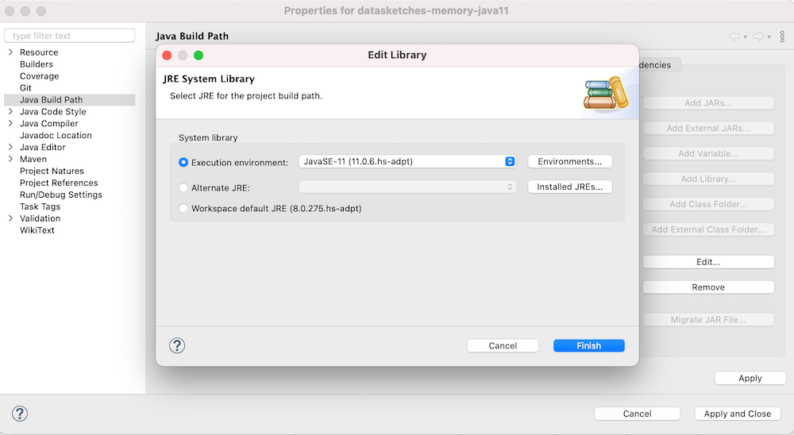
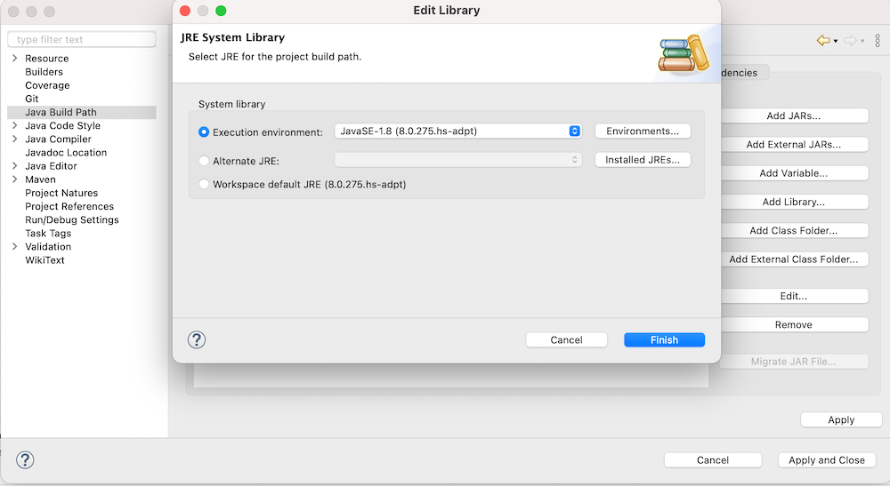

<!--
    Licensed to the Apache Software Foundation (ASF) under one
    or more contributor license agreements.  See the NOTICE file
    distributed with this work for additional information
    regarding copyright ownership.  The ASF licenses this file
    to you under the Apache License, Version 2.0 (the
    "License"); you may not use this file except in compliance
    with the License.  You may obtain a copy of the License at

      http://www.apache.org/licenses/LICENSE-2.0

    Unless required by applicable law or agreed to in writing,
    software distributed under the License is distributed on an
    "AS IS" BASIS, WITHOUT WARRANTIES OR CONDITIONS OF ANY
    KIND, either express or implied.  See the License for the
    specific language governing permissions and limitations
    under the License.
-->


# Eclipse IDE Setup

The use of Maven submodules to build a Multi Release JAR was motivated by its compatibility with 
popular IDEs. There are two configuration properties to be aware of when configuring your local 
development environment:

1) Java compiler versions
2) Compiler arguments for JPMS

### Java compiler versions

Settings are usually synchronized with Maven Toolchain configuration, otherwise the Java version 
for a Maven module should be set as follows:

| Maven submodule            | JDK |
| -------------------------- | --- |
| datasketches-memory-root   | 8   |
| datasketches-memory-java8  | 8   |
| datasketches-memory-java11 | 11  |

### Compiler arguments for JPMS

In order to compile Maven modules in Java versions 11 and above, it is necessary to provide the 
following arguments to the compiler.  These are usually synchronized with the `pom.xml` 
configuration:

```xml
    <compilerArgs>
        <arg>--add-exports</arg>
        <arg>java.base/jdk.internal.ref=org.apache.datasketches.memory</arg>
    </compilerArgs>
```

---

## Running Datasketches-Memory in Eclipse

Note that the following configuration was verified using Eclipse Version: 2020-12 (4.18.0)

### The eclipse maven plugin

The [Eclipse Maven plugin](https://maven.apache.org/plugins/maven-eclipse-plugin/) is used to 
generate Eclipse IDE files.  In order to run the eclipse plugin use:

    $ mvn clean eclipse:eclipse -DskipTests=true

More information about using the eclipse plugin with multi-module Maven builds can be found
in the Maven 
[Multiple Module Projects](https://maven.apache.org/plugins/maven-eclipse-plugin/reactor.html)
document.

Please note that this plugin is retired and no longer maintained!

---

### Importing the project into eclipse

From the **Package Explorer** View:

- Right-click on a blank space in the view
- Select **Import/Maven/Existing Maven Projects**
- Select **Next**, and browse to the project directory
- Click **Open**

---

### Setting compiler arguments for JPMS

Although these should be set automatically, the Eclipse IDE does not currently configure these 
settings according to the `pom.xml` - see this 
[Eclipse Bug](https://github.com/eclipse-m2e/m2e-core/issues/129).
Ensure that the required JPMS arguments are set for the compiler (Java 11 only).

- First, right-click on the `datasketches-memory-java11` project, and select 
**Properties/Java Build Path**. 
- Next, open the **Module Dependencies** tab and select the `java.base` package.
- Click on **Configured details**, followed by **Expose package**.
- In the dialog box, enter package: ```jdk.internal.ref```, and 
`org.apache.datasketches.memory` as the target module.
- Ensure that the **exports** checkbox is selected.



- Finally, click **Apply and Close**:



Note: These arguments need only be supplied for `datasketches-memory-java11`.

---

### Setting Java compiler settings

This should be set automatically by the IDE.  However, you may ensure that the correct Java 
compliance level is set for each module by using the Eclipse `Java Compiler` dialog.

- Open the **Java Compiler** dialog, and ensure **Enable project specific settings** is checked:



You might need to verify this for each module, making sure the correct compliance level is used:

- `datasketches-memory-java11` should use level 11 compliance.
- `datasketches-memory-java8` should use level 1.8 compliance.

---

### Setting JRE library versions

This should be set automatically by the IDE.  However, you may ensure that the correct JRE is 
used for each module by using the Eclipse **Java Build Path** dialog.

- First, open the project properties dialog for the `datasketches-memory-java11` project, and 
click on **Java Build Path**. 
- Next, open the **Libraries** tab and select the **JRE System Library** under **Modulepath**.
- Click **Edit** and ensure that the **Execution Environment** is selected and set to Java 11:



- Lastly, for all other modules, verify that the **Execution Environment** is selected and set 
to the Java 8 JRE:



### Running unit tests

- Under the `datasketches-memory-java8` module, right-click on the `src/test/java` 
directory.
- Select **Run-As** / **TestNG Test**
- It should open a new window and run over 400 tests without error.
