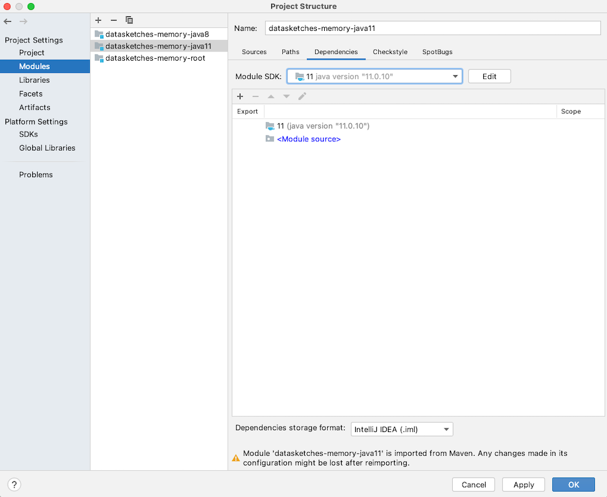
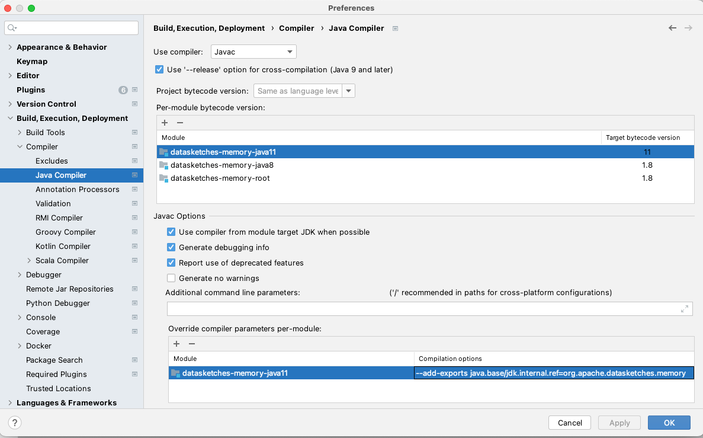

<!--
    Licensed to the Apache Software Foundation (ASF) under one
    or more contributor license agreements.  See the NOTICE file
    distributed with this work for additional information
    regarding copyright ownership.  The ASF licenses this file
    to you under the Apache License, Version 2.0 (the
    "License"); you may not use this file except in compliance
    with the License.  You may obtain a copy of the License at

      http://www.apache.org/licenses/LICENSE-2.0

    Unless required by applicable law or agreed to in writing,
    software distributed under the License is distributed on an
    "AS IS" BASIS, WITHOUT WARRANTIES OR CONDITIONS OF ANY
    KIND, either express or implied.  See the License for the
    specific language governing permissions and limitations
    under the License.
-->

# IntelliJ IDE Setup

The use of Maven submodules to build a Multi Release JAR was motivated by its compatibility with 
popular IDEs.

There are two configuration properties to be aware of when configuring your local development 
environment:

1) Java compiler versions
2) Compiler arguments for JPMS

#### Java compiler versions

Settings are usually synchronised with maven toolchain configuration, otherwise the Java version 
for a maven module should be set as follows:

| Maven submodule                   | JDK |
| --------------------------------- | --- |
| datasketches-memory-root          |  8  |
| datasketches-memory               |  8  |
| datasketches-memory-java8         |  8  |
| datasketches-memory-java8-tests   |  8  |
| datasketches-memory-java9         |  9  |
| datasketches-memory-java11        |  11 |
| datasketches-memory-resources     |  8  |

#### Compiler arguments for JPMS

In order to compile Maven modules in Java versions 9 and above, it is necessary to provide the 
following arguments to the compiler.  These are usually synchronised with the `pom.xml` 
configuration:

```xml
    <compilerArgs>
        <arg>--add-exports</arg>
        <arg>java.base/jdk.internal.ref=org.apache.datasketches.memory</arg>
    </compilerArgs>
```

---

## Running Datasketches-Memory in IntelljJ-IDEA

Note that the following configuration was verified using IntelliJ IDEA 2021.1.2 
(Community Edition).

### Java compiler versions

Ensure that the correct SDK is used for each module using the IntelliJ project structure dialog:



---

### Compiler arguments for JPMS

Ensure that the required JPMS arguments are set for the compiler (Java 9 only).  
These should be detected and set automatically based on the `pom.xml` configuration.


