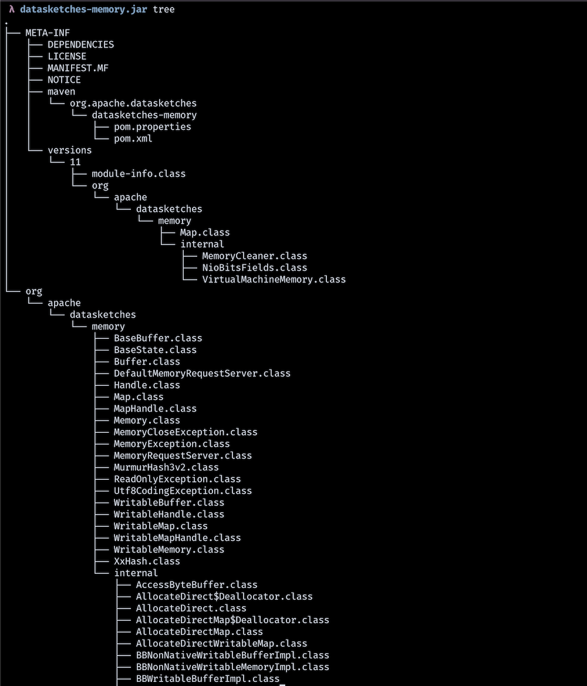

<!--
    Licensed to the Apache Software Foundation (ASF) under one
    or more contributor license agreements.  See the NOTICE file
    distributed with this work for additional information
    regarding copyright ownership.  The ASF licenses this file
    to you under the Apache License, Version 2.0 (the
    "License"); you may not use this file except in compliance
    with the License.  You may obtain a copy of the License at

      http://www.apache.org/licenses/LICENSE-2.0

    Unless required by applicable law or agreed to in writing,
    software distributed under the License is distributed on an
    "AS IS" BASIS, WITHOUT WARRANTIES OR CONDITIONS OF ANY
    KIND, either express or implied.  See the License for the
    specific language governing permissions and limitations
    under the License.
-->

# Multi-Release JAR

The `datasketches-memory` module assembles a multi-release (MR) JAR for release that consists of
multiple Java-release-specific versions of compiled class files.

From [JEP-238](https://openjdk.java.net/jeps/238):

> Third party libraries and frameworks typically support a range of Java platform versions, 
generally going several versions back. As a consequence they often do not take advantage of 
language or API features available in newer releases since it is difficult to express conditional 
platform dependencies, which generally involves reflection, or to distribute different library 
artifacts for different platform versions.

The next case describes the challenge in supporting newer versions of Java for libraries
such as DataSketches Memory:

> Some libraries and frameworks, furthermore, use internal APIs of the JDK that will be made 
inaccessible in Java 9 when module boundaries are strictly enforced. This also creates a 
disincentive to support new platform versions when there are public, supported API 
replacements for such internal APIs.

### Assembly

The Maven assembly plugin uses the Maven submodules during the `package` phase.  
The following maven submodules to source the compiled class files for the MR-JAR:

### Manifest

The Maven assembly plugin copies version specific class files into JAR manifest META-INF 
directory, as shown in the diagram below:

